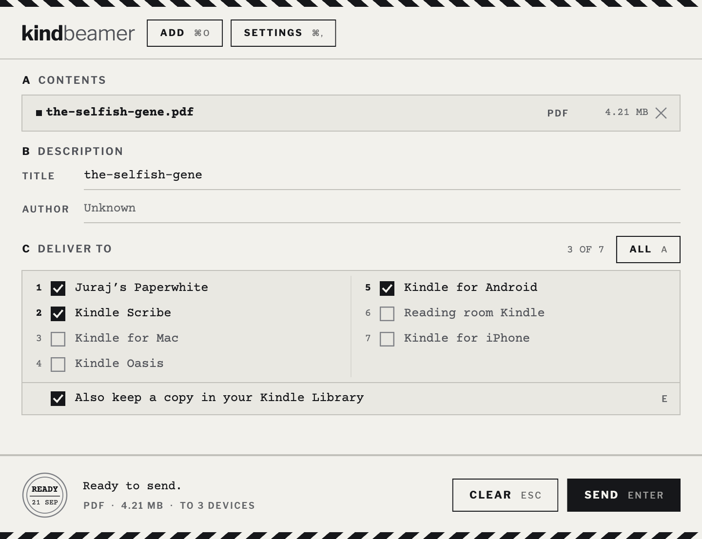

# KindBeamer

[](https://github.com/jooray/kindbeamer/actions/workflows/ci.yml)

KindBeamer sends your documents to your Kindle devices. It is an unofficial,
open-source replacement for Amazon's *Send to Kindle* desktop app: one Flutter
codebase covering **macOS (Apple Silicon and Intel)**, **Linux** and
**Android**, with no Rosetta needed.

It talks to the same Send to Kindle cloud service the official app uses, so your
documents arrive over Wi-Fi on the devices you pick, and in your Kindle Library
if you want them there.



> **Disclaimer:** this project is not affiliated with, endorsed by, or sponsored
> by Amazon. Use at your own risk; Amazon may change or block the undocumented
> API at any time.

## Install

### Android

Install it from [Zapstore](https://zapstore.dev/apps/dev.stkn.kindbeamer),
which will also keep it updated. Zapstore itself is at
[zapstore.dev](https://zapstore.dev).

Otherwise grab `KindBeamer-<version>.apk` from the
[latest release](https://github.com/jooray/kindbeamer/releases/latest) and open
it on the phone. Android will ask you to allow installs from that source.

### macOS

Download `KindBeamer-<version>.dmg` from the
[latest release](https://github.com/jooray/kindbeamer/releases/latest) and drag
the app into Applications.

The build is signed with a self-managed key rather than an Apple Developer
certificate, so Gatekeeper will refuse it on the first launch. Either right
click the app and choose Open, or clear the quarantine flag:

```bash
xattr -dr com.apple.quarantine /Applications/KindBeamer.app
```

### Linux

Take the tarball for your architecture from the
[latest release](https://github.com/jooray/kindbeamer/releases/latest):
`-linux-x64` for a normal PC, `-linux-arm64` for Omarchy on Apple silicon,
Asahi or an ARM box.

```bash
tar -xzf KindBeamer-1.0.1-linux-x64.tar.gz
./bundle/kindbeamer
```

It needs GTK 3 and glibc 2.34 or newer, which any current distribution has. On
Arch: `pacman -S gtk3 libsecret`, the second being what puts your Amazon
credentials in the keyring rather than a file. Move the bundle wherever you
keep such things and point the `.desktop` file in `packaging/linux/` at it for
"Open With" support.

## Features

- One window, laid out as a dispatch label: contents, description, the devices
  to deliver to, and a franking row that states the facts and sends. It opens
  already addressed — the file you dropped, a title from its name, the devices
  you ticked last time — so the usual visit is Enter.
- Monochrome e-paper, inverted at night and following the system by default.
  Nothing in the app is carried by colour, so it reads the same on any screen.
- A delivered send closes the window, unless Settings says otherwise; a failed
  one keeps it, with the reason on the label — in the app's own words, with the
  raw answer from Amazon folded away behind **Details**.
- When Amazon stops accepting this installation's registration, which it does
  when a session goes stale, the app opens the sign-in flow itself instead of
  leaving an error on screen. Signing in re-registers the same device, so your
  Kindles and the documents already on them are untouched.
- Keyboard-first: **Enter** sends, **Esc** clears then closes, **1-9** and
  **0** tick the device on that line, **A** takes all or none, **E** keeps the
  library copy, **?** prints the key list.
- Drop files anywhere on the window, pick them with a file dialog, or receive
  them from the OS share mechanisms listed below.
- Multi-document queue: drop a PDF and an EPUB at once, edit the metadata of
  each, send them in one go, with upload progress per document.
- Every registered Kindle device and app on your account, in two numbered
  columns so a long list needs no scrolling.
- Sign-in with your Amazon account over OAuth (PKCE) in an embedded browser
  window. The long-lived device credentials then go into the OS keychain or
  encrypted storage, and no password is ever stored.
- Input formats: PDF, EPUB, MOBI, AZW/AZW3, TXT, RTF, DOC, DOCX, HTML, PNG,
  JPG, GIF, BMP.
- Markdown as well. A dropped `.md` is typeset into a PDF sized for a 6" reader
  where `pandoc` and a PDF engine (or a headless Chrome) can run, which in
  practice means Linux. Everywhere else it becomes styled HTML and Kindle
  converts it on its side, including on macOS, whose sandbox will not run
  external tools.

### Share / open recipient matrix

| Platform | Mechanisms |
|---|---|
| macOS | drag & drop onto the window, Finder *Open With*, dock drop, macOS **Services** menu ("Send with KindBeamer") |
| Linux | drag & drop, file-manager *Open With* (`.desktop` file with MIME types, see `packaging/linux/`), command-line args |
| Android | system **share sheet** (single & multiple files), *Open with* for documents |

## Usage

1. Launch the app and press **Sign in** (or just **Enter**), then complete the
   Amazon login in the window that opens. (Linux has no embedded browser, so
   there the app opens your system browser and lets you paste the redirect URL
   instead.)
2. Open a document with KindBeamer — *Open With*, the share sheet, the Services
   menu, a drop onto the window, **Add files…**, or a path on the command line.
3. Press **Enter**. The label already carries the title, the devices you used
   last time and the library copy; change any of them first if you want to.
4. The postmark inks round as the upload goes, strikes solid on delivery, and
   the window leaves. Only a failure stays on screen, and it names the cause.

### Keys

| Key | What it does |
|---|---|
| `Enter` | Send — or sign in, when signed out |
| `Esc` | Clear the queue; with nothing queued, close the window |
| `1`…`9`, `0` | Tick the device on that line |
| `A` | All devices, or none |
| `E` | Keep a copy in your Kindle Library |
| `Backspace` | Drop the marked document |
| `⌘O` / `Ctrl+O` | Add files |
| `⌘,` / `Ctrl+,` | Settings |
| `?` | The list above, on the window |

Digits typed into the title or author field stay in the field.

Signing in registers that installation as a device on your Amazon account, shown
as "KindBeamer (your computer's name)" or "KindBeamer (Android)". Each
installation registers on its own, so a laptop and a phone can both stay signed
in. **Settings → Sign out** unregisters the one you are on and deletes its local
credentials.

### Where credentials live

The Amazon device credentials go into the OS keychain or encrypted storage.
Where no keychain is reachable, on Linux without a secret service or in a
macOS build signed with a self-managed key, the app falls back to a mode-600
file in its application-support directory, and **Settings** says which of the
two it used.

## How it works

See [SPECIFICATION.md](SPECIFICATION.md) for the architecture and a full
description of the wire protocol: OAuth PKCE device registration, signed
`stkservice.amazon.com` calls, S3 upload, delivery.

The protocol implementation is a clean-room Dart port of the approach taken by
[stkclient](https://github.com/maxdjohnson/stkclient) (MIT). Thanks to its
author for working the protocol out first.

## Building from source

Requirements: Flutter 3.47+ (stable).

```bash
flutter pub get
flutter run -d macos     # or: -d linux, an Android device/emulator
```

Release builds:

```bash
flutter build macos      # build/macos/Build/Products/Release/KindBeamer.app
flutter build linux      # build/linux/x64/release/bundle/
flutter build apk        # build/app/outputs/flutter-apk/app-release.apk
```

The Android build needs a JDK between 17 and 21, because Gradle 8.14 refuses
anything newer. If your default JDK is more recent:

```bash
flutter config --jdk-dir=/path/to/jdk-17
```

### Installing the Linux desktop entry

```bash
sudo install -Dm644 packaging/linux/dev.stkn.kindbeamer.png \
  /usr/share/icons/hicolor/512x512/apps/dev.stkn.kindbeamer.png
sudo desktop-file-install --mode=0755 \
  --dir=/usr/share/applications \
  packaging/linux/dev.stkn.kindbeamer.desktop
update-desktop-database /usr/share/applications
```

Point the `Exec=` line at your installed binary or bundle first.

### Tests

```bash
flutter analyze
flutter test
```

The tests cover the RSA request signer and the device pid derivation against
reference vectors, OAuth code parsing, file ingestion (PDF and EPUB drops,
filtering, dedup), Markdown conversion, app state (device identity,
preferences, queue handling), the per-platform release declarations that only
fail in a release build, and the main window widget tree. CI runs the same
checks and builds macOS, Android and Linux (x86-64 and arm64) on every push.

## BTW

The book in the screenshot is a real one, and mine.
[Tamers of Entropy](https://tamersofentropy.net/) is a lunarpunk novel about
identity, parallel spaces, AI, space and expanding consciousness. Paperback,
ebook and audiobook, in English, Slovak and Czech. There is a
[trailer](https://youtu.be/APLe95FRUhg).

## Related projects

KindBeamer exists because other people worked the protocol out first. None of
these projects are ours.

- [stkclient](https://github.com/maxdjohnson/stkclient) is a Python library for
  Amazon's Send to Kindle service. KindBeamer's protocol code is a clean-room
  Dart port of the approach it takes.
- [sendKindle](https://github.com/kparal/sendKindle) is the original
  command-line tool for mailing documents to a Kindle. Its last code change was
  in 2019 and the repository is now archived, so it takes no issues or pull
  requests. Its author asks anyone who wants it revived to fork it.
- [kindle-send](https://github.com/nikhil1raghav/kindle-send) sends web pages
  and documents from the terminal. It turns a URL into an EPUB first, which
  makes it a good fit for scripted page archiving.
- [sendtokindle](https://github.com/miracle2k/sendtokindle) is an earlier
  Ubuntu-only GUI for the same job. Nothing has been committed to it since
  2016, and its app indicator no longer fits current desktops.
- [KindleEar](https://github.com/cdhigh/KindleEar) runs Calibre recipes on a
  schedule and pushes news, RSS feeds and EPUBs to your Kindle.
- The [Send to Kindle Calibre plugin](https://github.com/bookfere/Send-to-Kindle-Calibre-Plugin)
  is for people who already live inside Calibre.

They differ mostly in how the file travels. stkclient goes to Amazon's service
over HTTP, the way KindBeamer does. The others hand the document to Amazon's
mail gateway, which means a mail account of your own and whatever attachment
limit it comes with.

## License

MIT, see [LICENSE](LICENSE). The app icon is drawn rather than generated:
`tools/make_icons.py` paints the master art at `assets/icon/icon-1024.png` and
derives the per-platform sets from it (macOS `.appiconset`, Android adaptive
icon, Linux PNG).
